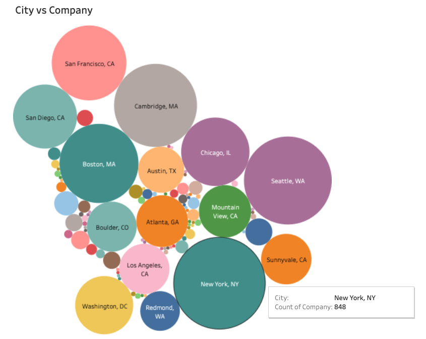

# DATA SCIENTIST JOB MARKET

In this project, we discussed the data scientist job market in the Austin, TX area. What are the requirements to be hired, who are the big players in the industry, what are the skills and education demanded the most.

## Finding the Data

## Context

For those who are actively looking for data scientist jobs in the U.S., the best news this month is the LinkedIn Workforce Report August 2018. According to the report, there is a shortage of 151,717 people with data science skills, with particularly acute shortages in New York City, San Francisco Bay Area and Los Angeles.

To help job hunters (including all of us) to better understand the job market, we scraped Indeed website and collected information of 7,000 data scientist jobs around the U.S. on August. The information that I collected are: Company Name, Position Name, Location, Job Description, and Number of Reviews of the Company.

## Possible Questions:
* Who gets hired? 
* What kind of talent do employers want when they are hiring a data scientist?
* Which location has the most opportunities?
* What skills, tools, degrees or majors do employers want the most for data scientists?
* What's the difference between data scientist, data engineer and data analyst?
* Can you develop an efficient classification algorithm to differentiate the three job types above?

## Visualizations  

Possible visualizations are going to be 

* bubble chart, 
* scatter plot with mulitple axis and 
* heat map for the location of the jobs etc...

#### Example Bubble Chart

## Hosting with Heroku and SQLite

We will deploy the project Flask app to Heroku.

* We will use sqlite for the database.

- - -
